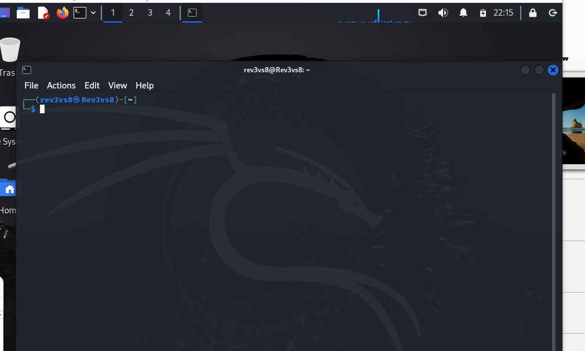
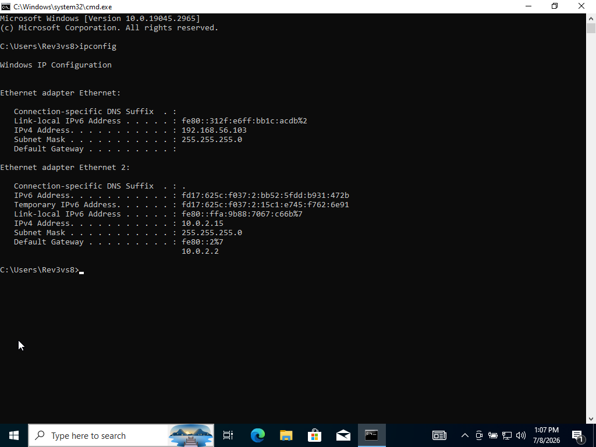

# SOC Lab Engineering Report
## Lab 01 — Home SOC Lab Environment Setup

---

| Field | Details |
|---|---|
| **Author** | Ibitayo Alasi |
| **Current Role** | IT Support Specialist |
| **Target Role** | SOC Analyst |
| **Lab Number** | 01 of 20 |
| **Phase** | Phase 1 — Foundation |
| **Date Completed** | 8 July 2026 |
| **Status** | ✅ Complete |

---

## 1. Executive Summary

This report documents the design, configuration, and deployment of a fully isolated SOC home lab environment. The lab simulates a small enterprise environment containing an attacker/security testing machine, a Windows monitored endpoint, and isolated network communication between both systems. This infrastructure serves as the foundation for all subsequent SOC analyst training exercises including SIEM implementation, detection engineering, threat hunting, and incident response.

---

## 2. Objectives

- Deploy a hypervisor-based lab environment on a personal Ubuntu workstation
- Configure two virtual machines with dual network adapters each
- Establish isolated VM-to-VM communication simulating a real enterprise network segment
- Prepare Kali Linux as the security testing workstation
- Prepare Windows 10 as a monitored endpoint
- Take baseline snapshots for lab reset capability
- Document all configurations for portfolio and professional reference

---

## 3. Environment Specifications

### Host Machine
| Component | Details |
|---|---|
| OS | Ubuntu 24.04 LTS |
| Hardware | HP Laptop |
| RAM | 8GB |
| Hypervisor | Oracle VirtualBox 7.2 |

### Virtual Machines
| VM Name | OS | RAM | Disk | IP Address | Role |
|---|---|---|---|---|---|
| Kali Attacker | Kali Linux 2024.2 | 1GB | 25GB | 192.168.56.101 | Attacker / Security Workstation |
| Windows Target | Windows 10 22H2 | 2GB | 50GB | 192.168.56.103 | Monitored Endpoint / Victim |

---

## 4. Network Architecture

```
+---------------------------------------------+
|           Ubuntu Host — 8GB RAM             |
|           Oracle VirtualBox 7.2             |
|                                             |
|  +----------------------------------------+ |
|  |       Internal Network: soclab         | |
|  |         192.168.56.0/24                | |
|  |                                        | |
|  |  +---------------+  +---------------+  | |
|  |  | Kali Attacker |  |Windows Target |  | |
|  |  | 192.168.56.101|  |192.168.56.103 |  | |
|  |  |               |  |               |  | |
|  |  | NIC1: NAT     |  | NIC1: NAT     |  | |
|  |  | NIC2: soclab  |  | NIC2: soclab  |  | |
|  |  +---------------+  +---------------+  | |
|  +----------------------------------------+ |
+---------------------------------------------+
```

> Note: Security tools (Nmap, Wireshark, Metasploit) and monitoring tools
> (Sysmon, Splunk Agent, Event Viewer) will be installed and used in
> Labs 02 onwards. This lab focuses purely on infrastructure setup.

---

## 5. Implementation Steps

### 5.1 Hypervisor Installation
- Removed corrupted VirtualBox 7.0 package via forced dpkg removal
- Installed VirtualBox 7.2 from Oracle official repository
- Resolved Linux kernel 6.17 compatibility issues
- Configured virtualization environment (VM creation, RAM, CPU, storage, network adapters)

### 5.2 Network Configuration
- Created internal network named `soclab`
- Configured subnet 192.168.56.0/24
- Assigned static IPs to both VMs on NIC2 (internal network adapter)
- NIC1 configured as NAT on both VMs for internet access

### 5.3 Kali Linux Deployment
- Installed Kali Linux 2024.2 as security testing workstation
- Configured network interfaces and verified connectivity
- Prepared terminal environment for future security tooling

### 5.4 Windows Endpoint Deployment
- Installed Windows 10 22H2 as monitored enterprise endpoint
- Configured network adapters
- Verified network connectivity via ipconfig
- Prepared for future Sysmon, Windows Event monitoring, and SIEM log collection

### 5.5 Baseline Snapshot
- Captured clean snapshots of both VMs post-installation
- Snapshots serve as restore points before each lab exercise

---

## 6. Technical Challenges & Resolutions

| # | Challenge | Root Cause | Resolution |
|---|---|---|---|
| 1 | VirtualBox kernel module failure | Kernel 6.17 incompatibility with VBox 7.0 | Upgraded to VirtualBox 7.2 |
| 2 | Secure Boot blocking kernel modules | HP laptop Secure Boot policy | Resolved via MOK signing + VBox 7.2 |
| 3 | Host-Only network unreachable | VBox 7.2 Host-Only driver bug on kernel 6.17 | Switched to Internal Network mode |
| 4 | Broken dpkg package state | Pre-removal scripts referencing missing files | Force-removed via dpkg --force-all |
| 5 | Kali no internet on first boot | Only Host-Only NIC active | Configured NAT as NIC1 + verified with ping |

---

## 7. Commands Used

### Linux Networking
```bash
# View network interfaces
ip addr show

# View routing table
ip route

# Request DHCP address
sudo dhclient

# Test connectivity
ping 192.168.56.103

# Assign static IP manually
sudo ip addr add 192.168.56.101/24 dev eth1
sudo ip link set eth1 up
```

### VirtualBox CLI (vboxmanage)
```bash
# Create VM
vboxmanage createvm --name "Kali Attacker" --ostype Debian_64 --register

# Configure hardware
vboxmanage modifyvm "Kali Attacker" --memory 1024 --cpus 2 --nic1 nat --nic2 intnet --intnet2 soclab

# Take snapshot
vboxmanage snapshot "Kali Attacker" take "Clean Install"

# List VMs
vboxmanage list vms
```

---

## 8. Evidence

### Kali Linux — Security Workstation Running


### Windows 10 — Target Endpoint Network Configuration


---

## 9. Findings

- A functional SOC practice environment was successfully created
- Kali Linux deployed as the security workstation
- Windows 10 prepared as a monitored endpoint
- Network communication between both VMs established on isolated internal network
- Virtualization troubleshooting skills developed through real-world problem solving
- Clean baseline snapshots captured for all future lab resets

---

## 10. SOC Analyst Relevance

| Skill Practiced | SOC Application |
|---|---|
| Virtual networking | Enterprise network architecture understanding |
| Kali Linux administration | Security testing and offensive awareness |
| Windows endpoint setup | Detection target and log source configuration |
| Troubleshooting | Real-world SOC infrastructure problem solving |
| Lab documentation | Professional reporting and evidence collection |

---

## 11. MITRE ATT&CK Relevance

This lab establishes infrastructure for future simulation and detection of:

| Technique | ID |
|---|---|
| Command and Scripting Interpreter | T1059 |
| Network Service Scanning | T1046 |
| System Information Discovery | T1082 |
| Lateral Movement | T1021 |
| Initial Access | T1190 |

---

## 12. Key Takeaways

1. **VirtualBox version matters** — VBox 7.0 has critical incompatibilities with Linux kernel 6.17; always use 7.2+
2. **Internal Network > Host-Only** — On newer kernels, Internal Network mode is significantly more stable
3. **Snapshots are non-negotiable** — Clean baseline before every lab exercise prevents hours of reinstallation
4. **Troubleshooting IS the skill** — Resolving real infrastructure problems mirrors actual SOC engineering work
5. **Dual NIC design is essential** — NAT for internet access + isolated network for lab traffic separation

---

## 13. Next Lab

**Lab 02 — Network Traffic Capture & Analysis with Wireshark**
Capture and analyze live traffic between Kali and Windows VMs. Identify protocols, filter HTTP/DNS/ICMP, detect a simulated port scan, and write a traffic analysis report.

---

*Report authored by Ibitayo Alasi — IT Support Specialist → SOC Analyst*
*GitHub: [github.com/ialasi](https://github.com/ialasi)*
