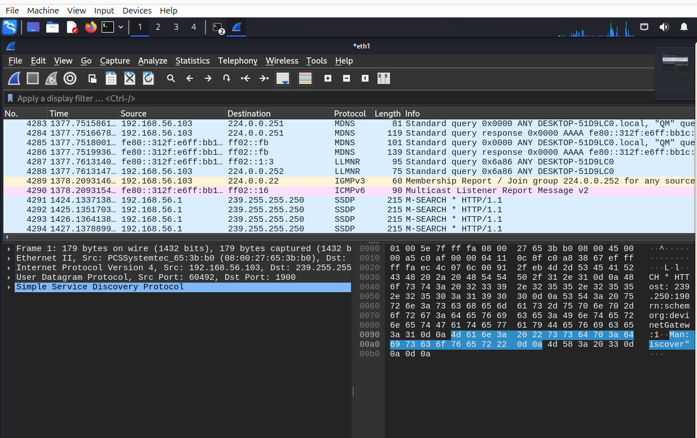
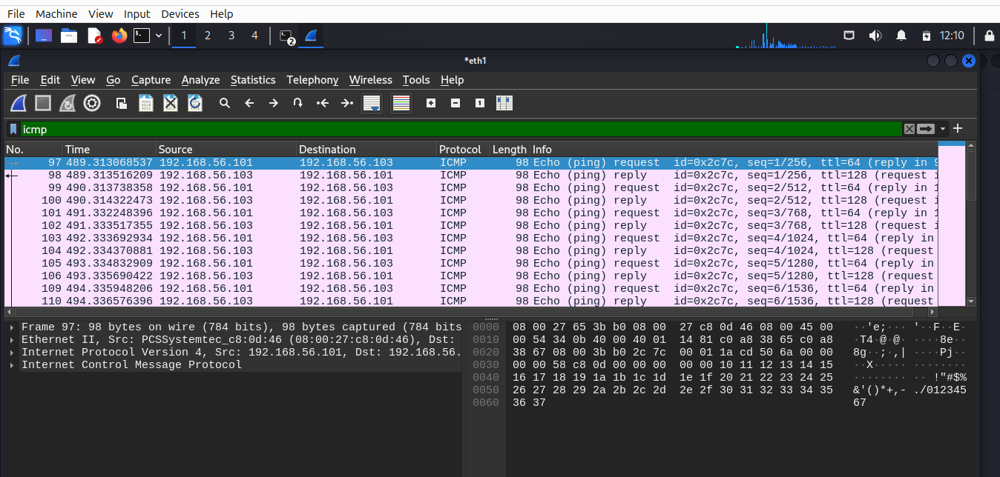
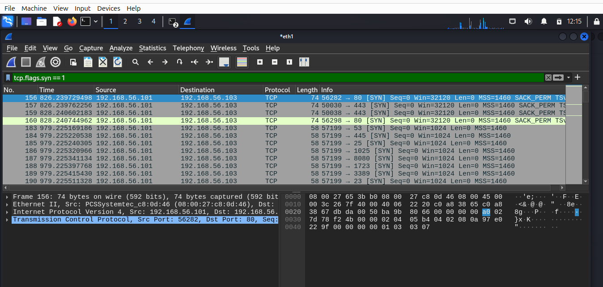
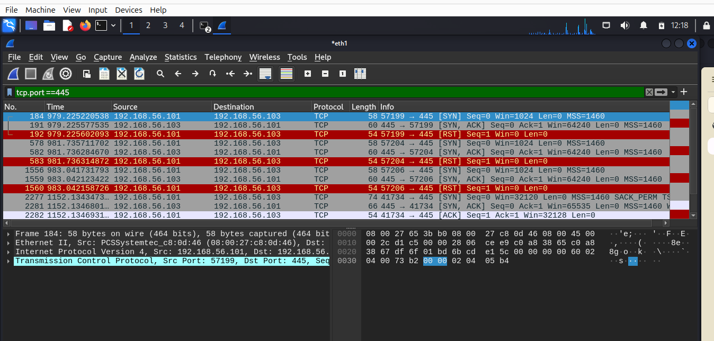
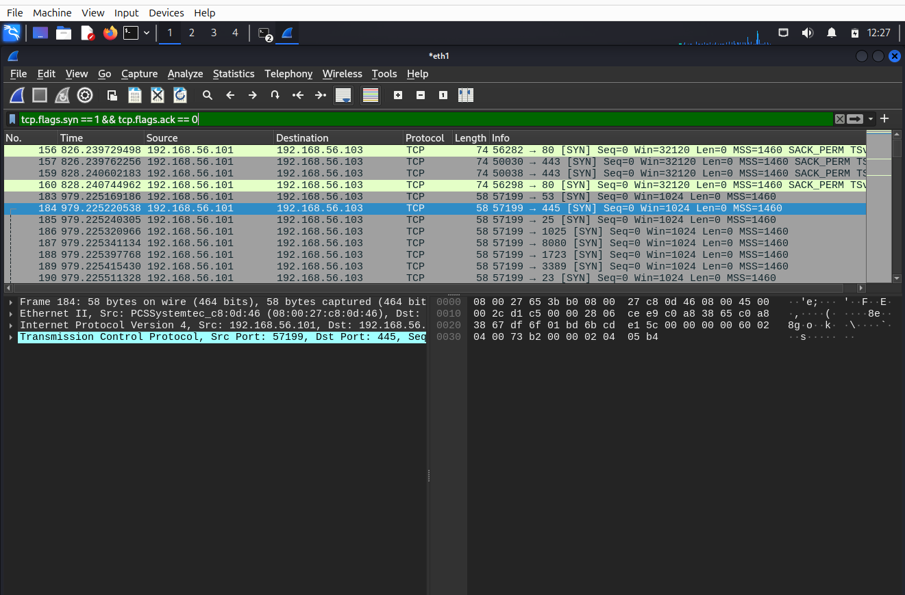

# SOC Lab Engineering Report
## Lab 02 — Network Traffic Capture & Analysis with Wireshark

---

| Field | Details |
|---|---|
| **Author** | Ibitayo Alasi |
| **Current Role** | IT Support Specialist |
| **Target Role** | SOC Analyst |
| **Lab Number** | 02 of 20 |
| **Phase** | Phase 1 — Foundation |
| **Date Completed** | 10 July 2026 |
| **Status** | ✅ Complete |

---

## 1. Executive Summary

This lab demonstrates live network traffic capture and analysis using Wireshark on Kali Linux. Traffic was generated between the Kali attacker machine (192.168.56.101) and the Windows 10 target machine (192.168.56.103) across the isolated internal lab network. The lab covers ICMP analysis, TCP handshake inspection, Nmap SYN scan detection, and SMB port investigation — all core skills for a SOC analyst conducting network forensics.

---

## 2. Objectives

- Capture live network traffic using Wireshark on Kali Linux (eth1 interface)
- Generate and analyze ICMP (ping) traffic between Kali and Windows
- Simulate and detect a Nmap SYN port scan
- Identify open ports on the Windows target machine
- Apply Wireshark display filters to isolate specific traffic types
- Save PCAP file as evidence for future analysis
- Map findings to MITRE ATT&CK framework

---

## 3. Environment

| Component | Details |
|---|---|
| Attacker Machine | Kali Linux 2024.2 — 192.168.56.101 |
| Target Machine | Windows 10 22H2 — 192.168.56.103 |
| Capture Tool | Wireshark 4.2.5 |
| Scanning Tool | Nmap 7.94SVN |
| Capture Interface | eth1 (Internal Network — soclab) |
| PCAP File | lab02-capture.pcap (435KB) |

---

## 4. Attack Simulations Performed

### 4.1 ICMP Ping Sweep
Generated ICMP echo request/reply traffic between Kali and Windows to test connectivity and observe packet structure.

```bash
ping -c 20 192.168.56.103
```

### 4.2 Nmap SYN Scan (Stealth Scan)
Performed a TCP SYN scan against the Windows target to enumerate open ports without completing full TCP connections.

```bash
sudo nmap -sS -Pn 192.168.56.103
```

### 4.3 Nmap Service Version Scan
Performed a service version detection scan to identify running services on open ports.

```bash
nmap -sV -Pn 192.168.56.103
```

---

## 5. Wireshark Filters Used

| Filter | Purpose | What It Shows |
|---|---|---|
| `icmp` | Isolate ping traffic | Echo requests and replies |
| `tcp.flags.syn == 1` | Detect port scanning | All SYN packets from Nmap |
| `tcp.flags.syn == 1 && tcp.flags.ack == 0` | Isolate attack packets only | Pure SYN probes without responses |
| `tcp.port == 445` | Monitor SMB traffic | Port 445 scan and responses |

---

## 6. Findings

### 6.1 Open Ports Discovered on Windows Target

| Port | Service | Risk Level | Description |
|---|---|---|---|
| 135 | MSRPC | 🟡 Medium | Microsoft Remote Procedure Call — remote code execution risk |
| 139 | NetBIOS-SSN | 🟡 Medium | NetBIOS session service — legacy Windows sharing |
| 445 | Microsoft-DS (SMB) | 🔴 High | Server Message Block — WannaCry ransomware target |

### 6.2 ICMP Analysis
- 20 ICMP echo requests sent from 192.168.56.101 → 192.168.56.103
- 20 ICMP echo replies received — 0% packet loss
- **TTL=64** on requests (Linux/Kali signature)
- **TTL=128** on replies (Windows signature)
- TTL values can be used to identify operating systems without a full scan

### 6.3 Nmap SYN Scan Signature
The SYN scan produced a distinctive traffic pattern:

```
Kali ──[SYN]──────────► Windows   (Nmap probing port)
Kali ◄─[SYN, ACK]────── Windows   (Port confirmed OPEN)
Kali ──[RST]──────────► Windows   (Nmap resets — stealth)
```

**Key Nmap signatures detected in Wireshark:**
- Window size **Win=1024** — Nmap's fingerprint (normal browsers use 65535+)
- Rapid sequential port probing from single source IP
- RST packets immediately after SYN,ACK — no full connection established
- 997 filtered ports, 3 open ports confirmed

---

## 7. TCP Flag Analysis

| Flag | Full Name | Meaning | Observed In |
|---|---|---|---|
| SYN | Synchronize | Initiate connection | Nmap probe packets |
| SYN,ACK | Synchronize-Acknowledge | Port open, ready to connect | Windows responses |
| RST | Reset | Abort connection immediately | Nmap stealth reset |
| ACK | Acknowledge | Confirm received packet | Normal traffic |

---

## 8. Port Reference — Key Ports in This Lab

| Port | Protocol | SOC Relevance |
|---|---|---|
| 135 | MSRPC | Remote code execution attacks |
| 139 | NetBIOS | Legacy Windows lateral movement |
| 445 | SMB | WannaCry, EternalBlue, ransomware |
| 3389 | RDP | Brute force, ransomware delivery |
| 4444 | Metasploit | Default attacker shell — always alert |

---

## 9. Evidence

### Wireshark Capture Started on eth1


### ICMP Filter — Ping Traffic Analysis


### TCP SYN Scan Detection — Nmap Fingerprint


### Port 445 SMB Traffic — SYN/SYN-ACK/RST Pattern


### Nmap Scan Results — Open Ports Discovered


---

## 10. SOC Analyst Relevance

| Skill Practiced | Real SOC Application |
|---|---|
| Wireshark capture on specific interface | SOC analysts capture traffic on monitored segments |
| ICMP analysis + TTL fingerprinting | OS identification without active scanning |
| SYN scan detection | Detecting reconnaissance before an attack |
| Port 445 monitoring | Critical — most ransomware uses SMB |
| Display filter writing | Daily skill in network forensics |
| PCAP evidence preservation | Required for incident response documentation |

---

## 11. MITRE ATT&CK Mapping

| Technique | ID | Observed Activity |
|---|---|---|
| Network Service Scanning | T1046 | Nmap SYN scan across all ports |
| OS Fingerprinting | T1082 | TTL values revealing OS type |
| Network Sniffing | T1040 | Wireshark capturing all traffic |

---

## 12. Detection Rules — What a SOC Would Alert On

```
ALERT: Port scan detected
  Source IP:    192.168.56.101
  Target IP:    192.168.56.103
  Ports probed: 1000+
  Time window:  < 30 seconds
  SYN packets:  997
  Win size:     1024 (Nmap signature)
  Action:       Investigate source IP immediately
```

---

## 13. Key Takeaways

1. **TTL reveals OS** — Linux TTL=64, Windows TTL=128 — no scan needed
2. **Win=1024 = Nmap** — window size fingerprints the scanning tool
3. **SYN→SYN,ACK→RST = stealth scan** — attacker confirming open ports silently
4. **Port 445 open = high risk** — SMB must be monitored 24/7 in real SOC
5. **Wireshark filters are essential** — raw captures have thousands of packets; filters reveal the story
6. **PCAP files are evidence** — always save captures before closing Wireshark

---

## 14. Next Lab

**Lab 03 — Linux Log Analysis + Syslog Parsing**
Analyze authentication logs, failed login attempts, and system events on Kali Linux using bash tools — grep, awk, cut, and sed.

---

*Report authored by Ibitayo Alasi — IT Support Specialist → SOC Analyst*
*GitHub: [github.com/ialasi](https://github.com/ialasi)*
