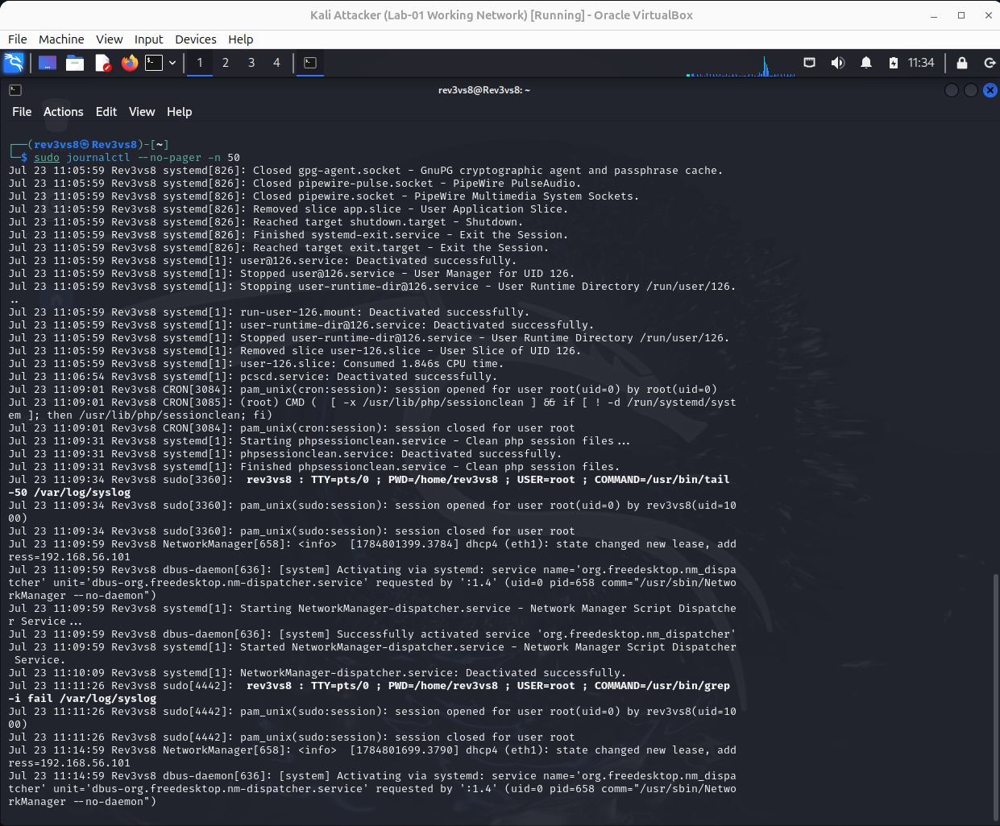
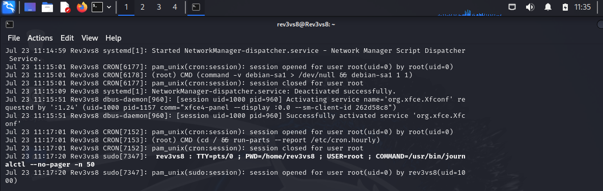
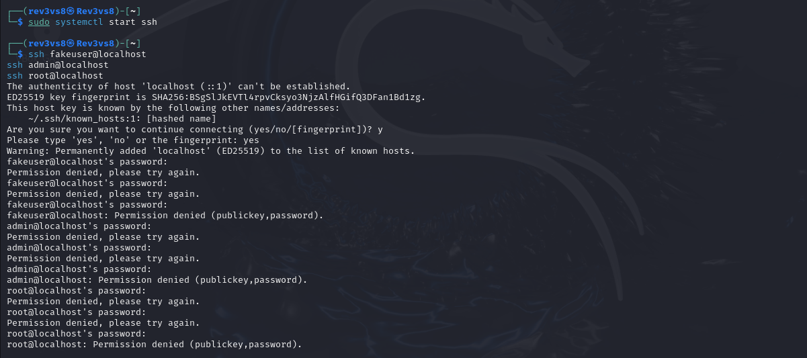
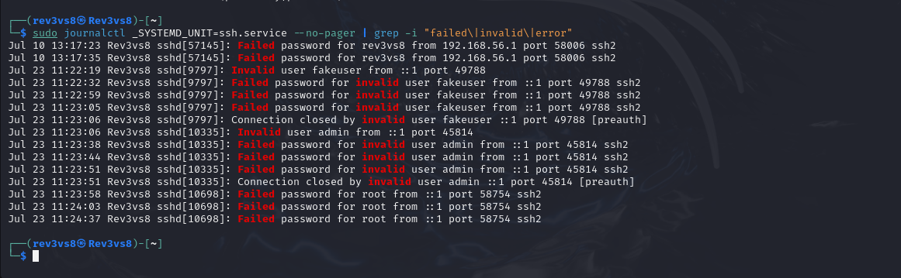
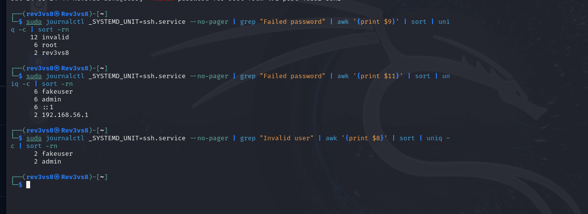
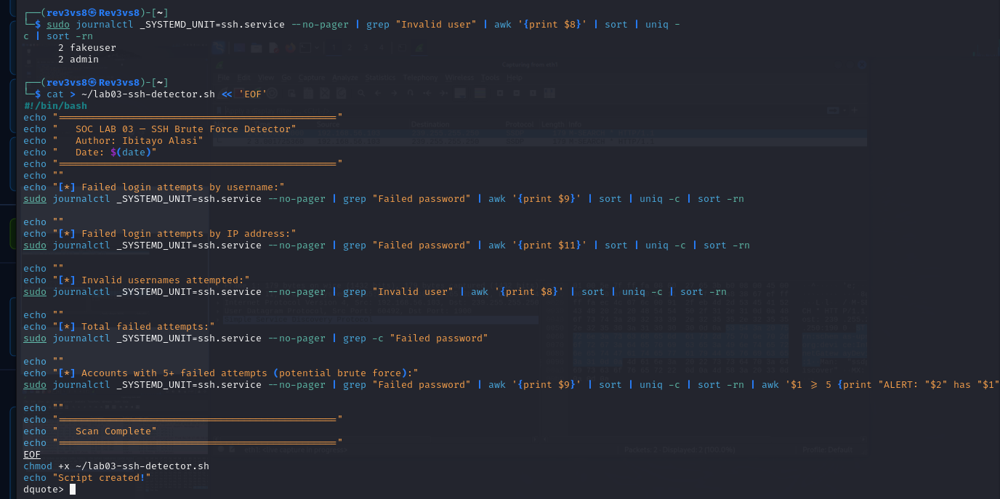

# SOC Lab Engineering Report
## Lab 03 — Linux Log Analysis + Syslog Parsing

---

| Field | Details |
|---|---|
| **Author** | Ibitayo Alasi |
| **Current Role** | IT Support Specialist |
| **Target Role** | SOC Analyst |
| **Lab Number** | 03 of 20 |
| **Phase** | Phase 1 — Foundation |
| **Date Completed** | 24 July 2026 |
| **Status** | ✅ Complete |

---

## 1. Executive Summary

This lab demonstrates Linux log analysis and SSH brute force detection using bash tools on Kali Linux. Failed SSH login attempts were simulated against three usernames (fakeuser, admin, root) and detected using journalctl, grep, and awk. A custom bash detection script was written to automate the identification of brute force patterns — a core SOC analyst skill used daily in real enterprise environments.

---

## 2. Objectives

- Explore Linux log files and understand their structure
- Use journalctl to query systemd journal logs
- Simulate SSH brute force attacks against Kali Linux
- Detect failed login attempts using grep, awk, and sort
- Write a custom bash detection script
- Export findings to a report file
- Map activity to MITRE ATT&CK framework

---

## 3. Environment

| Component | Details |
|---|---|
| Analysis Machine | Kali Linux 2024.2 — 192.168.56.101 |
| Log Source | systemd journal (/var/log/journal) |
| Tools Used | journalctl, grep, awk, sort, uniq, bash |
| Script Created | lab03-ssh-detector.sh |
| Findings File | lab03-findings.txt |

---

## 4. Linux Log Files Overview

Kali Linux uses systemd journal instead of traditional syslog files. Key log sources:

| Log Source | Command | Purpose |
|---|---|---|
| systemd journal | `journalctl` | All system events |
| SSH service logs | `journalctl _SYSTEMD_UNIT=ssh.service` | SSH authentication events |
| Kernel logs | `journalctl -k` | Kernel messages |
| Boot logs | `journalctl -b` | Current boot events |
| Auth events | `journalctl SYSLOG_FACILITY=10` | Authentication events |

---

## 5. Attack Simulation

### 5.1 Enable SSH Service
```bash
sudo systemctl start ssh
sudo systemctl enable ssh
```

### 5.2 Simulate Brute Force Logins
Three fake usernames were used to simulate a brute force attack:

```bash
ssh fakeuser@localhost   # 3 failed attempts — invalid user
ssh admin@localhost      # 3 failed attempts — invalid user
ssh root@localhost       # 3 failed attempts — valid user, wrong password
```

Each attempt resulted in "Permission denied" after 3 password tries, generating authentication failure events in the systemd journal.

---

## 6. Detection Commands

### 6.1 View SSH Logs with Failures Highlighted
```bash
sudo journalctl _SYSTEMD_UNIT=ssh.service --no-pager | grep -i "failed|invalid|error"
```

### 6.2 Count Failed Attempts by Username
```bash
sudo journalctl _SYSTEMD_UNIT=ssh.service --no-pager | grep "Failed password" | awk '{print $9}' | sort | uniq -c | sort -rn
```

### 6.3 Count Failed Attempts by IP Address
```bash
sudo journalctl _SYSTEMD_UNIT=ssh.service --no-pager | grep "Failed password" | awk '{print $11}' | sort | uniq -c | sort -rn
```

### 6.4 Find Invalid Usernames Attempted
```bash
sudo journalctl _SYSTEMD_UNIT=ssh.service --no-pager | grep "Invalid user" | awk '{print $8}' | sort | uniq -c | sort -rn
```

---

## 7. Findings

### 7.1 Failed Login Summary

| Username | Failed Attempts | Type | Severity |
|---|---|---|---|
| invalid | 12 | Non-existent accounts | 🟡 Medium |
| root | 6 | Valid account targeted | 🔴 High |
| rev3vs8 | 2 | Real user targeted | 🔴 High |

### 7.2 Source IP Analysis

| Source | Count | Meaning |
|---|---|---|
| fakeuser | 6 | Simulated attacker username |
| admin | 6 | Simulated attacker username |
| ::1 | 6 | Localhost (simulation source) |
| 192.168.56.1 | 2 | VirtualBox host gateway |

### 7.3 Invalid Usernames Attempted

| Username | Count | SOC Relevance |
|---|---|---|
| fakeuser | 2 | Non-existent account — enumeration |
| admin | 2 | Common default account guess |

### 7.4 Total Failed Attempts
**20 failed SSH login attempts detected**

---

## 8. Detection Script Output

```
================================================
   SOC LAB 03 - SSH Brute Force Detector
   Author: Ibitayo Alasi
   Date: Fri Jul 24 05:38:31 WAT 2026
================================================

[*] Failed login attempts by username:
     12 invalid
      6 root
      2 rev3vs8

[*] Failed login attempts by IP address:
      6 fakeuser
      6 admin
      6 ::1
      2 192.168.56.1

[*] Invalid usernames attempted:
      2 fakeuser
      2 admin

[*] Total failed attempts:
20

[*] Accounts with 5+ failed attempts (potential brute force):
ALERT: invalid has 12 failed attempts
ALERT: root has 6 failed attempts

================================================
   Scan Complete
================================================
```

---

## 9. Bash Tools Reference

| Tool | Purpose | Example |
|---|---|---|
| `journalctl` | Query systemd journal | `journalctl -n 50` |
| `grep` | Search for patterns | `grep "Failed password"` |
| `awk` | Extract specific fields | `awk '{print $9}'` |
| `sort` | Sort output | `sort -rn` |
| `uniq -c` | Count unique occurrences | `uniq -c` |
| `tail` | Show last N lines | `tail -50` |
| `wc -l` | Count lines | `wc -l` |

---

## 10. Evidence

### System Journal Logs


### Journal Logs Continued


### SSH Brute Force Simulation


### Failed Login Detection


### Bash Analysis Commands


### Detection Script Output


---

## 11. SOC Analyst Relevance

| Skill Practiced | Real SOC Application |
|---|---|
| journalctl log analysis | Primary log tool on Linux servers |
| grep pattern matching | Filtering thousands of log entries |
| awk field extraction | Parsing structured log data |
| Brute force detection | Most common SSH attack pattern |
| Bash scripting | Automating repetitive SOC tasks |
| Findings documentation | Evidence collection for IR reports |

---

## 12. MITRE ATT&CK Mapping

| Technique | ID | Observed Activity |
|---|---|---|
| Brute Force — Password Guessing | T1110.001 | Multiple failed SSH password attempts |
| Valid Accounts | T1078 | Root account targeted |
| Account Discovery | T1087 | Invalid usernames attempted (enumeration) |

---

## 13. Detection Rule

```
ALERT: SSH Brute Force Detected
  Threshold:  5+ failed attempts in 60 seconds
  Source:     Any IP
  Target:     SSH service (port 22)
  Usernames:  root, admin, invalid users
  Action:     Block source IP + notify SOC team
  Priority:   HIGH — root account targeted
```

---

## 14. Key Takeaways

1. **journalctl replaces syslog on modern Linux** — always check journal first on Kali/Ubuntu
2. **awk is essential** — extracts specific fields from structured log data instantly
3. **Root account attacks = immediate high alert** — root SSH should be disabled in production
4. **Invalid usernames = reconnaissance** — attacker is enumerating accounts before targeting real ones
5. **Automation saves time** — a 5-line bash script detects what would take hours manually
6. **20 failed attempts in minutes** — real attackers run thousands per second using tools like Hydra

---

## 15. Next Lab

**Lab 04 — Windows Event Log Investigation**
Investigate Windows Security Event logs using Event Viewer and PowerShell. Detect failed logins (4625), new account creation (4720), privilege escalation (4732), and post-exploit recon (4688).

---

*Report authored by Ibitayo Alasi — IT Support Specialist → SOC Analyst*
*GitHub: [github.com/ialasi](https://github.com/ialasi)*
