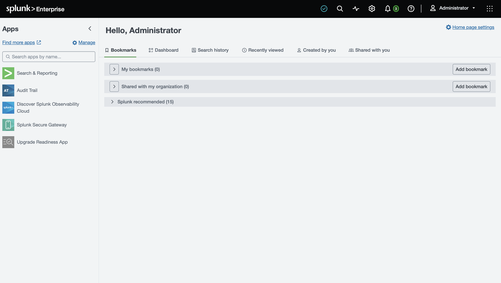
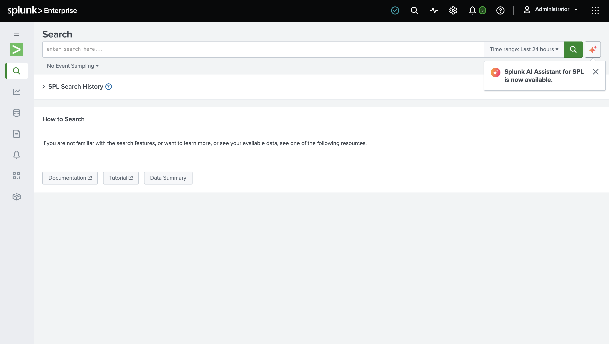
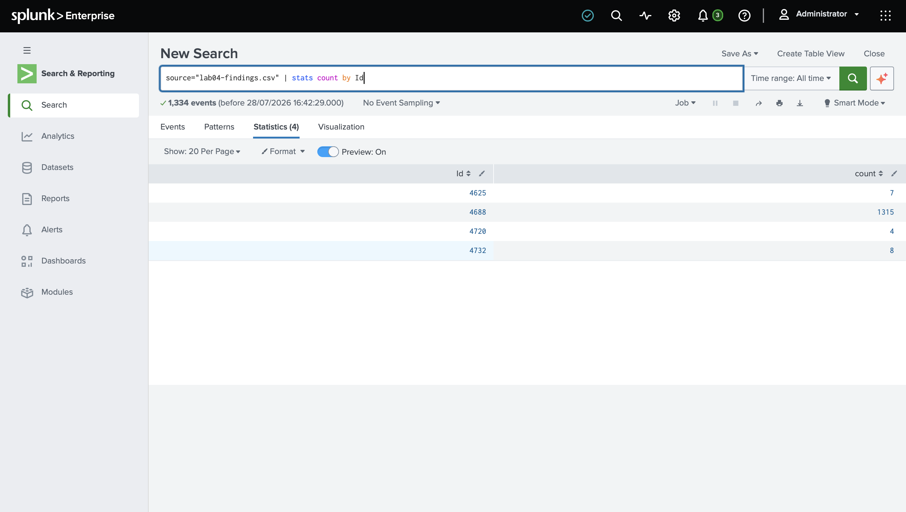
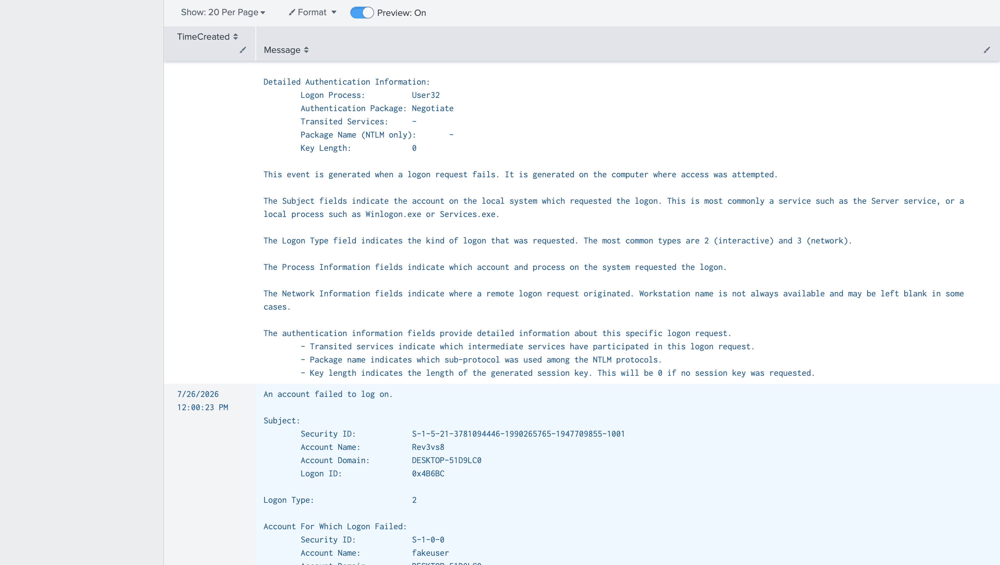
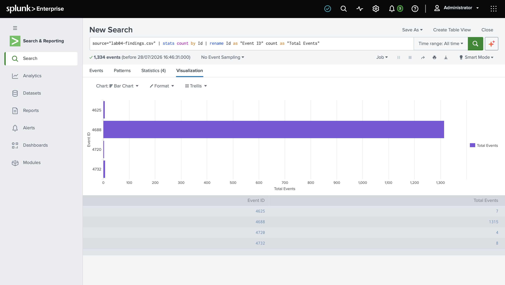
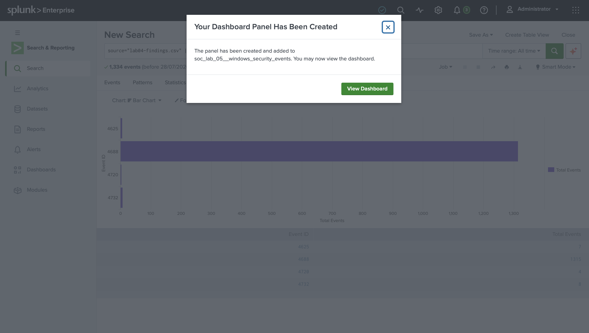
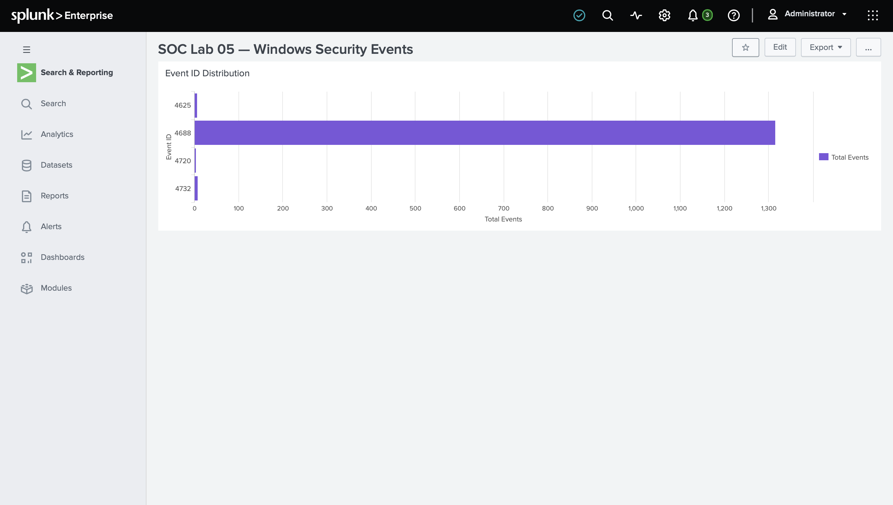

# SOC Lab Engineering Report
## Lab 05 — Splunk Free SIEM Setup & Windows Security Event Analysis

---

| Field | Details |
|---|---|
| **Author** | Ibitayo Alasi |
| **Current Role** | IT Support Specialist |
| **Target Role** | SOC Analyst |
| **Lab Number** | 05 of 20 |
| **Phase** | Phase 1 — Foundation |
| **Date Completed** | 28 July 2026 |
| **Status** | ✅ Complete |

---

## 1. Executive Summary

This lab covers the installation and configuration of Splunk Enterprise on Apple Silicon (M4 Pro MacBook), ingestion of 1,334 Windows Security Event logs from Lab 04, SPL query writing, and dashboard creation. The lab demonstrates core SIEM skills — data ingestion, threat hunting with SPL, and visualization — all fundamental daily activities for a SOC analyst.

---

## 2. Objectives

- Install Splunk Enterprise 10.4.1 on macOS (Apple Silicon M4 Pro)
- Ingest Windows Security Event logs from Lab 04 (lab04-findings.csv)
- Write SPL queries to detect security events
- Investigate failed login attempts (Event ID 4625) in Splunk
- Create a SOC dashboard with event visualization
- Map findings to MITRE ATT&CK framework

---

## 3. Environment

| Component | Details |
|---|---|
| SIEM Platform | Splunk Enterprise 10.4.1 |
| Host Machine | MacBook Pro M4 Pro (Apple Silicon) |
| Operating System | macOS |
| Data Source | lab04-findings.csv (Windows Security Events) |
| Total Events Ingested | 1,334 events |
| Splunk URL | http://localhost:8000 |

---

## 4. Installation

### 4.1 Download and Install Splunk
```bash
# Download Splunk Enterprise ARM64 for macOS
# Version: splunk-10.4.1-5a009d941268-darwin-arm64.dmg

# Install via DMG
# Drag to Applications folder
# Start Splunk
/Applications/Splunk/bin/splunk start
```

### 4.2 Initial Configuration
- Created admin account
- Accepted license agreement
- Accessed Splunk Web at http://localhost:8000

---

## 5. Data Ingestion

### 5.1 Upload Windows Security Events
Uploaded `lab04-findings.csv` containing 1,334 Windows Security Events:

**Settings → Add Data → Upload → lab04-findings.csv**

- Source type: csv (auto-detected)
- Host: rev3vs8s-MacBook-Pro.local
- Index: default

### 5.2 Events Successfully Ingested
```
✅ File has been uploaded successfully
✅ 1,334 events indexed
✅ Source type: csv
✅ Timestamps parsed correctly
```

---

## 6. SPL Queries

### 6.1 Event ID Distribution
```spl
source="lab04-findings.csv" | stats count by Id
```

**Results:**
| Event ID | Count | Description |
|---|---|---|
| 4625 | 7 | Failed logon attempts |
| 4688 | 1315 | Process creation events |
| 4720 | 4 | User accounts created |
| 4732 | 8 | Users added to Administrators |
| **Total** | **1,334** | **All security events** |

### 6.2 Failed Login Investigation
```spl
source="lab04-findings.csv" Id=4625 | table TimeCreated Message
```

### 6.3 Dashboard Visualization
```spl
source="lab04-findings.csv" | stats count by Id | rename Id as "Event ID" count as "Total Events"
```

---

## 7. Findings

### 7.1 Failed Login Events (4625) — 7 Events
- **Account targeted:** fakeuser, admin, administrator
- **Failure Reason:** Unknown user name or bad password
- **Status Code:** 0xC000006D
- **Logon Type:** 2 (Interactive)
- **Workstation:** DESKTOP-51D9LC0
- **Time Range:** 7/26/2026 4:03 AM — 12:00 PM

### 7.2 Process Creation Events (4688) — 1,315 Events
- Dominated the dataset — normal Windows activity
- Includes post-exploitation recon: whoami, ipconfig, net user
- Command-line logging captured full process details

### 7.3 Account Creation Events (4720) — 4 Events
- **New account:** testbackdoor
- **Created by:** Rev3vs8 (simulated compromised account)
- **Time:** 7/26/2026 4:09:41 AM

### 7.4 Privilege Escalation Events (4732) — 8 Events
- testbackdoor added to Administrators group
- Critical security event — immediate alert in production

---

## 8. Dashboard Created

**Dashboard Name:** SOC Lab 05 — Windows Security Events
**Panel:** Event ID Distribution (Bar Chart)

The dashboard visually shows the dominance of Event ID 4688 (1,315 events) compared to the critical but low-volume events (4625, 4720, 4732) — a realistic representation of what SOC analysts see in production SIEMs.

---

## 9. SPL Reference — Key Queries for SOC Analysts

```spl
# Count all events by type
source="lab04-findings.csv" | stats count by Id

# Find failed logins
source="lab04-findings.csv" Id=4625 | table TimeCreated Message

# Find account creation
source="lab04-findings.csv" Id=4720 | table TimeCreated Message

# Find privilege escalation
source="lab04-findings.csv" Id=4732 | table TimeCreated Message

# Find recon commands
source="lab04-findings.csv" Id=4688 | table TimeCreated Message

# Timeline of events
source="lab04-findings.csv" | timechart count by Id

# Top events by count
source="lab04-findings.csv" | top Id
```

---

## 10. Evidence

### Splunk Dashboard Home


### Search & Reporting


### Event ID Statistics


### Failed Login Investigation (4625)


### Bar Chart Visualization


### Dashboard Created


### Final SOC Dashboard


---

## 11. SOC Analyst Relevance

| Skill Practiced | Real SOC Application |
|---|---|
| Splunk installation | Primary SIEM used in 60%+ of enterprise SOCs |
| Data ingestion | Daily log source onboarding task |
| SPL query writing | Core skill for threat hunting |
| Event ID analysis | Windows forensics investigation |
| Dashboard creation | SOC situational awareness tool |
| Failed login investigation | Most common SOC alert type |

---

## 12. MITRE ATT&CK Mapping

| Technique | ID | Splunk Detection |
|---|---|---|
| Brute Force | T1110.001 | Id=4625 count > 5 |
| Create Local Account | T1136.001 | Id=4720 |
| Account Manipulation | T1098 | Id=4732 |
| Command and Scripting | T1059.001 | Id=4688 + whoami/net user |

---

## 13. Key Takeaways

1. **Splunk is the industry standard** — 60%+ of enterprise SOCs use Splunk as their primary SIEM
2. **SPL is essential** — Search Processing Language is a must-learn skill for SOC analysts
3. **1,334 events in one session** — real SOC analysts process millions of events daily using saved searches and alerts
4. **4688 dominates** — process creation events are the most common; filtering is critical
5. **Dashboards save lives** — visual representation of events enables faster threat detection
6. **Low count ≠ low priority** — 4 account creation events are far more critical than 1,315 process events

---

## 14. Next Lab

**Lab 06 — Nmap Scanning + Alerting**
Perform network reconnaissance using Nmap from Kali Docker container, capture results, then detect the scan in Splunk using SPL alert rules.

---

*Report authored by Ibitayo Alasi — IT Support Specialist → SOC Analyst*
*GitHub: [github.com/ialasi](https://github.com/ialasi)*
