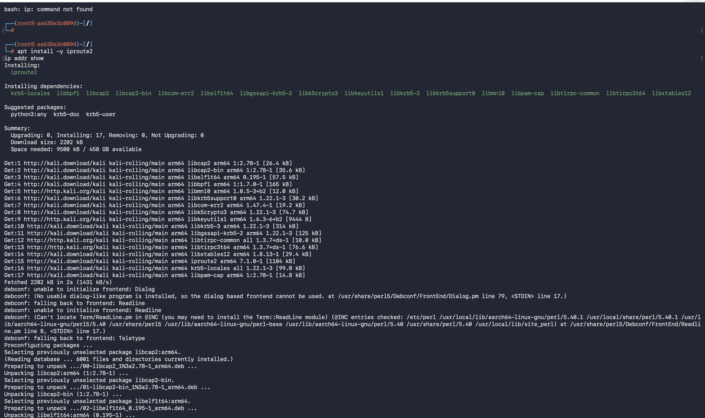
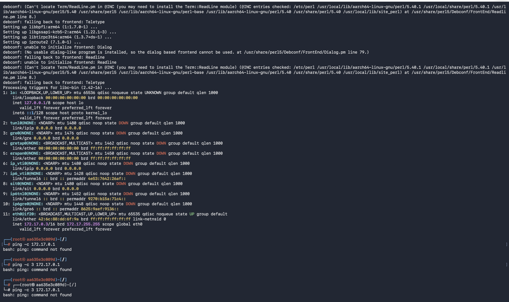
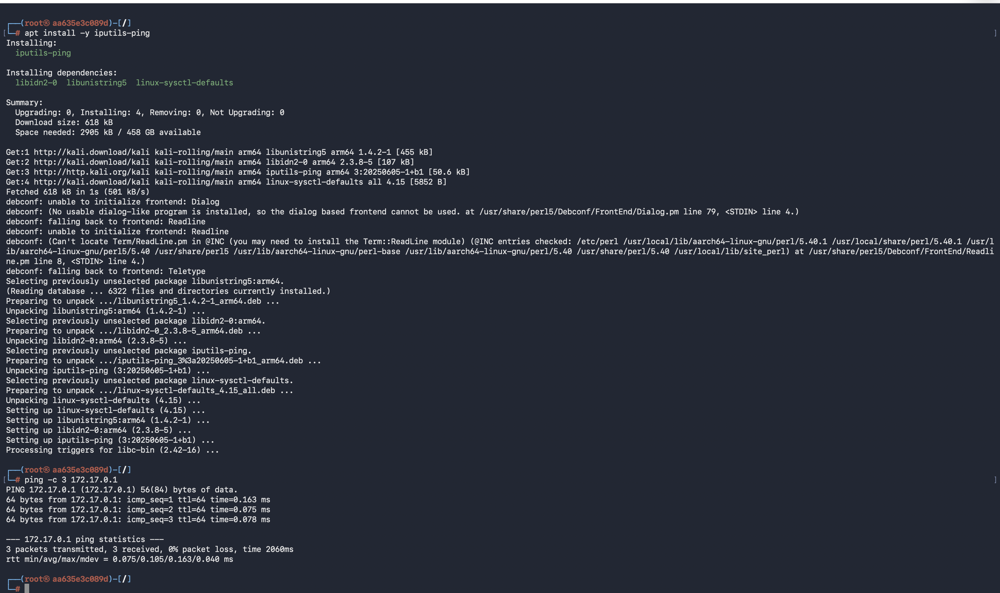
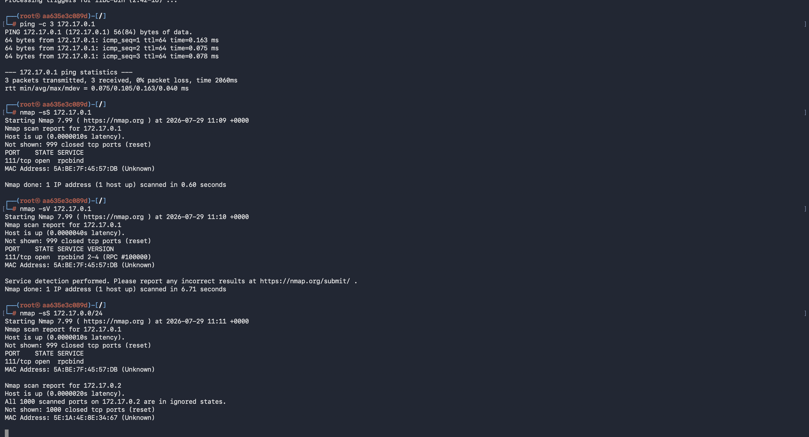
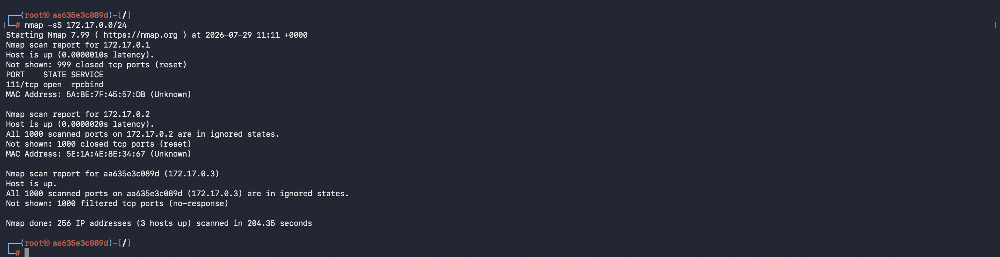
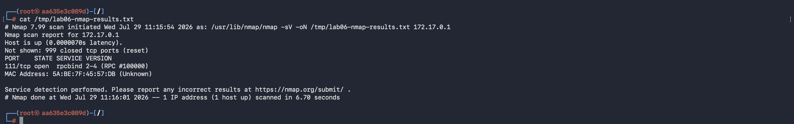
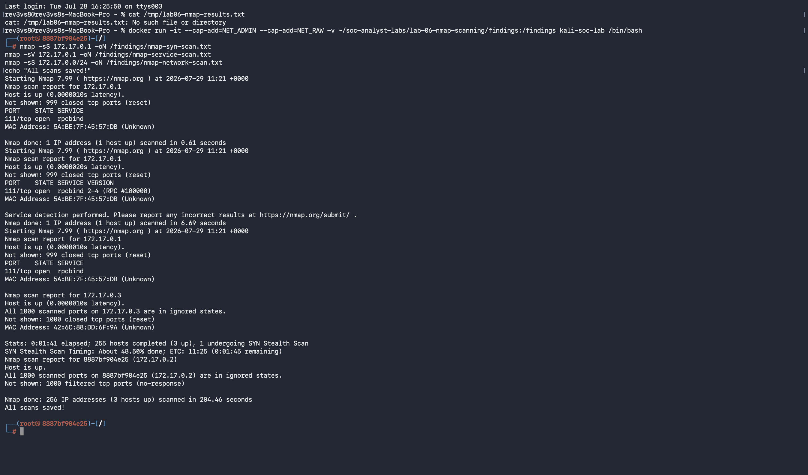

# SOC Lab Engineering Report
## Lab 06 — Nmap Scanning + Alerting

---

| Field | Details |
|---|---|
| **Author** | Ibitayo Alasi |
| **Current Role** | IT Support Specialist |
| **Target Role** | SOC Analyst |
| **Lab Number** | 06 of 20 |
| **Phase** | Phase 2 — Detection |
| **Date Completed** | 29 July 2026 |
| **Status** | ✅ Complete |

---

## 1. Executive Summary

This lab demonstrates network reconnaissance using Nmap from a Kali Linux Docker container against the Mac host machine. Three scan types were performed — SYN stealth scan, service version scan, and full network scan — simulating real attacker reconnaissance techniques. Results were saved as evidence files and analyzed from the defender perspective. This lab covers both the attacker mindset (how scanning works) and the defender mindset (what signatures to detect).

---

## 2. Objectives

- Launch Kali Linux Docker container with network capabilities
- Perform ICMP ping sweep to discover live hosts
- Execute Nmap SYN stealth scan (T1046)
- Execute Nmap service version detection scan
- Perform full network range scan (172.17.0.0/24)
- Save all scan results as evidence files
- Understand attacker reconnaissance methodology
- Map findings to MITRE ATT&CK framework

---

## 3. Environment

| Component | Details |
|---|---|
| Attacker | Kali Linux Docker Container (ARM64) |
| Attacker IP | 172.17.0.3 |
| Target | MacBook Pro M4 Pro (Docker Host) |
| Target IP | 172.17.0.1 |
| Network | Docker Internal Network 172.17.0.0/16 |
| Nmap Version | 7.99 |
| Scan Date | 29 July 2026 |

---

## 4. Docker Setup

### Launch Kali Container with Network Capabilities
```bash
docker run -it \
  --cap-add=NET_ADMIN \
  --cap-add=NET_RAW \
  -v ~/soc-analyst-labs/lab-06-nmap-scanning/findings:/findings \
  kali-soc-lab /bin/bash
```

The `-v` flag mounts the findings folder so scan results persist after container exits.

---

## 5. Attack Simulations

### 5.1 ICMP Ping Sweep
```bash
ping -c 3 172.17.0.1
```

**Result:**
```
3 packets transmitted, 3 received, 0% packet loss
rtt min/avg/max/mdev = 0.075/0.105/0.163/0.040 ms
```
Host is alive and responding.

### 5.2 Nmap SYN Stealth Scan
```bash
nmap -sS 172.17.0.1 -oN /findings/nmap-syn-scan.txt
```

**Result:**
```
PORT    STATE SERVICE
111/tcp open  rpcbind
MAC Address: 5A:BE:7F:45:57:DB (Unknown)
Nmap done: 1 IP address (1 host up) scanned in 0.61 seconds
```

### 5.3 Nmap Service Version Scan
```bash
nmap -sV 172.17.0.1 -oN /findings/nmap-service-scan.txt
```

**Result:**
```
PORT    STATE SERVICE VERSION
111/tcp open  rpcbind 2-4 (RPC #100000)
MAC Address: 5A:BE:7F:45:57:DB (Unknown)
Service detection performed.
Nmap done: 1 IP address (1 host up) scanned in 6.69 seconds
```

### 5.4 Full Network Scan
```bash
nmap -sS 172.17.0.0/24 -oN /findings/nmap-network-scan.txt
```

**Result:**
```
Nmap scan report for 172.17.0.1 — Port 111/tcp open (rpcbind)
Nmap scan report for 172.17.0.2 — All 1000 ports closed
Nmap scan report for 172.17.0.3 — All 1000 ports filtered
Nmap done: 256 IP addresses (3 hosts up) scanned in 204.46 seconds
```

---

## 6. Findings

### 6.1 Open Ports Discovered

| Host | IP | Port | Service | Version | Risk |
|---|---|---|---|---|---|
| Mac Host | 172.17.0.1 | 111/tcp | rpcbind | 2-4 (RPC #100000) | 🟡 Medium |

### 6.2 Network Hosts Discovered

| IP | Status | Ports | Notes |
|---|---|---|---|
| 172.17.0.1 | Up | 111 open | Mac Docker host |
| 172.17.0.2 | Up | All closed | Previous Docker container |
| 172.17.0.3 | Up | All filtered | Current Kali container |

### 6.3 Port 111 — rpcbind Analysis
- **Service:** Remote Procedure Call bind — maps RPC services to ports
- **Risk:** Can be used for NFS enumeration and RPC-based attacks
- **Recommendation:** Restrict access to trusted hosts only

---

## 7. Nmap Scan Types Explained

| Scan Type | Flag | How It Works | SOC Detection |
|---|---|---|---|
| SYN Stealth | -sS | Sends SYN, gets SYN/ACK, sends RST | TCP SYN flood from one IP |
| Service Version | -sV | Completes handshake, grabs banner | Full TCP connections to many ports |
| Ping Sweep | -sn | ICMP echo requests | Multiple ICMP from one source |
| Full Network | -sS /24 | Scans entire subnet | Rapid sequential host probing |

---

## 8. Defender Perspective — Detection Signatures

### What SOC Would See in SIEM:
```
ALERT: Network Reconnaissance Detected
  Source IP:    172.17.0.3
  Target IP:    172.17.0.1
  Ports probed: 1000+
  Time window:  < 1 second
  Protocol:     TCP SYN
  Pattern:      Sequential port scanning
  Action:       Investigate source IP immediately
```

### Splunk Detection Query:
```spl
index=network sourcetype=firewall
| stats count by src_ip dest_port
| where count > 100
| sort -count
| rename src_ip as "Scanner IP" count as "Ports Scanned"
```

---

## 9. Evidence

### Kali Container Running


### Network Interfaces


### Ping Mac Host


### Nmap SYN + Service Scans


### Nmap Results Detail


### Network Scan


### All Scans Saved


---

## 10. SOC Analyst Relevance

| Skill Practiced | Real SOC Application |
|---|---|
| Nmap SYN scan | Understanding attacker recon techniques |
| Service version detection | Asset inventory and vulnerability assessment |
| Network range scanning | Discovering unauthorized devices |
| Evidence preservation | Saving scan results for IR documentation |
| Attacker/Defender mindset | Core SOC analyst thinking pattern |

---

## 11. MITRE ATT&CK Mapping

| Technique | ID | Description |
|---|---|---|
| Network Service Scanning | T1046 | Nmap port scanning |
| Active Scanning | T1595 | Network range discovery |
| Gather Victim Network Info | T1590 | rpcbind service enumeration |

---

## 12. Key Takeaways

1. **Nmap is the standard** — used by both attackers for recon and defenders for asset discovery
2. **SYN scan leaves minimal logs** — designed to avoid detection on older systems
3. **Port 111 rpcbind** — legacy service that should be restricted in production
4. **Network scanning is noisy** — 256 hosts in 204 seconds generates significant traffic
5. **Docker networking** — containers get their own subnet (172.17.0.0/16) separate from host
6. **Volume mounting** — always mount findings folder to preserve container scan results

---

## 13. Next Lab

**Lab 07 — Snort IDS Setup + Custom Rule Writing**
Install Snort on Kali Linux Docker container, write custom detection rules for ICMP and port scans, trigger alerts using Nmap, and analyze alert logs.

---

*Report authored by Ibitayo Alasi — IT Support Specialist → SOC Analyst*
*GitHub: [github.com/ialasi](https://github.com/ialasi)*
