# Lab 07 – Snort IDS and Custom Rule Writing

| Field | Details |
|-------|---------|
| **Author** | Ibitayo Alasi |
| **Current Role** | IT Support Specialist |
| **Target Role** | SOC Analyst |
| **Lab Number** | 07 of 20 |
| **Phase** | Phase 2 — Network Detection Engineering |
| **Date Completed** | 5 August 2026 |
| **Status** | ✅ Complete |

---

# Technical Report

## Objective

The objective of this lab was to deploy and configure Snort 3 as a Network Intrusion Detection System (NIDS), create custom detection rules, validate the configuration, generate test network traffic, and verify that Snort successfully detected and logged malicious or suspicious activity.

---

## Lab Environment

| Component | Details |
|----------|---------|
| Host Machine | MacBook Pro (2019) |
| Host Operating System | macOS |
| Virtual Machine | Kali Linux |
| IDS Platform | Snort 3 |
| Configuration File | `snort.lua` |
| Custom Rule File | `local.rules` |
| Test Traffic | ICMP (Ping) and Nmap |

---

## Tools Used

- Snort 3
- Kali Linux
- Nmap
- Ping
- Nano / Vim
- Linux Terminal

---

## Technical Procedure

### 1. Installed and Verified Snort

Snort 3 was installed and verified to ensure the intrusion detection engine was functioning correctly before configuration.

**Evidence**

*Screenshot: Snort version verification*

---

### 2. Configured Snort

The `snort.lua` configuration file was reviewed and updated to enable local rule loading and proper packet inspection.

**Evidence**

*Screenshot: snort.lua configuration*

---

### 3. Created Custom Detection Rules

Custom rules were written in `local.rules` to detect ICMP traffic and other test events generated during the lab.

Example rule:

```snort
alert icmp any any -> any any (msg:"ICMP Ping Detected"; sid:1000001; rev:1;)
```

**Evidence**

*Screenshot: local.rules*

---

### 4. Validated the Configuration

The Snort configuration was validated to ensure there were no syntax or configuration errors before starting the IDS.

Example command:

```bash
sudo snort -c /etc/snort/snort.lua -R /etc/snort/rules/local.rules
```

**Evidence**

*Screenshot: Configuration validation*

---

### 5. Generated Test Traffic

Test traffic was generated using ICMP ping requests and Nmap scanning to trigger the custom detection rules.

Example commands:

```bash
ping <target-ip>
```

```bash
nmap <target-ip>
```

**Evidence**

*Screenshot: Test traffic generation*

---

### 6. Verified Snort Alerts

Snort successfully detected the generated traffic and produced alerts based on the configured rules. The alerts were reviewed to verify successful detection.

**Evidence**


## Evidence

### 1. Snort Installed
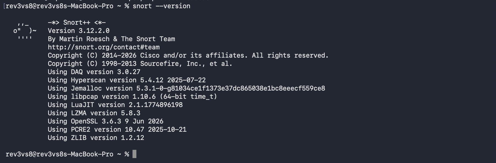

### 2. Custom Rules Created
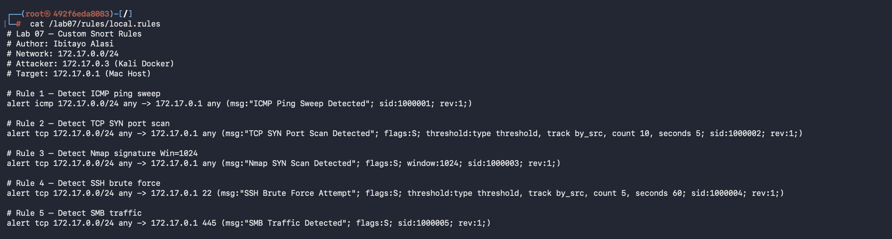

### 3. Snort Configuration
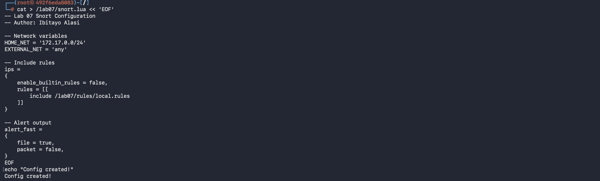

### 4. Snort Starting
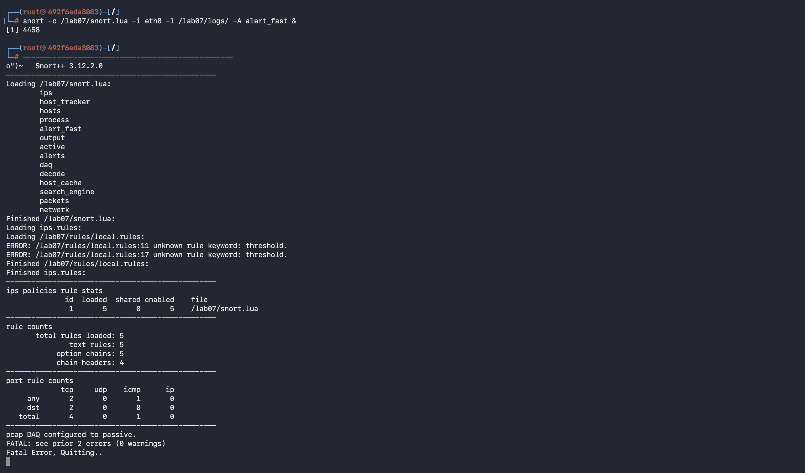

### 5. Snort Running
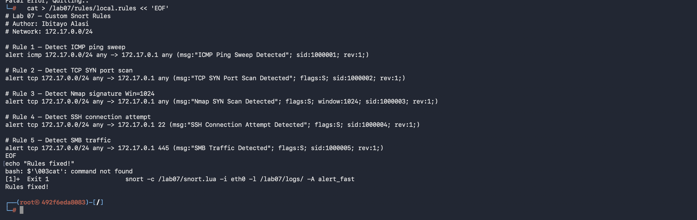

### 6. Rules Fixed
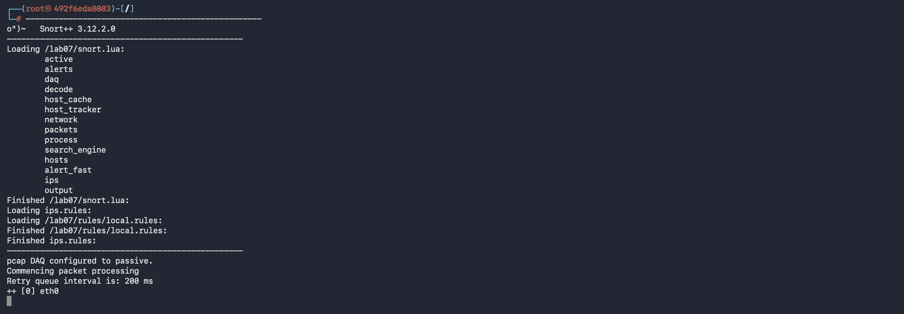

### 7. tcpdump Packet Capture
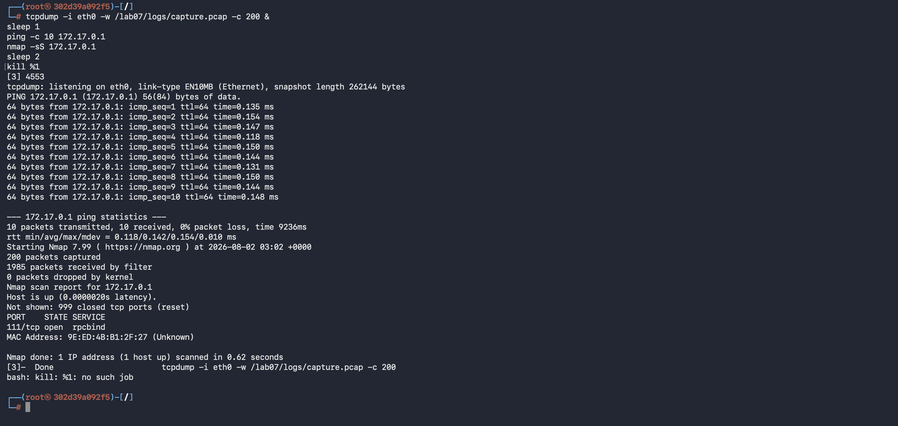

### 8. Snort PCAP Analysis
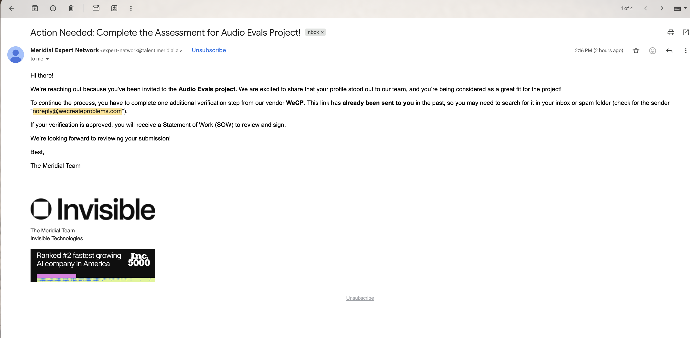

### 9. ICMP Alerts
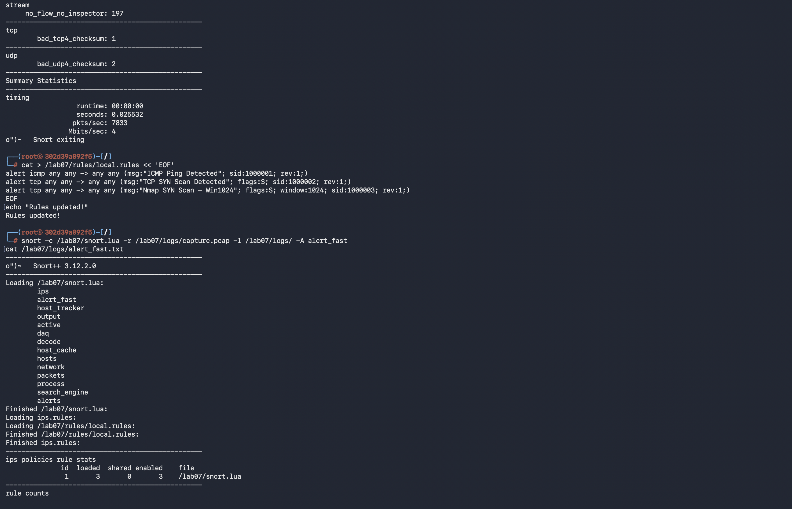

### 10. Additional ICMP Alerts
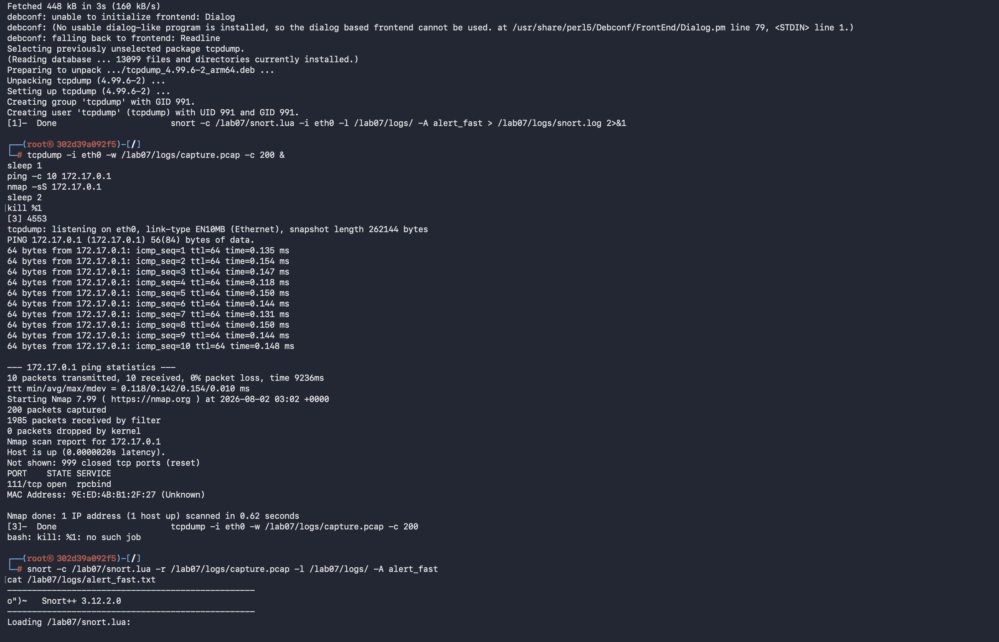

### 11. Nmap SYN Alerts
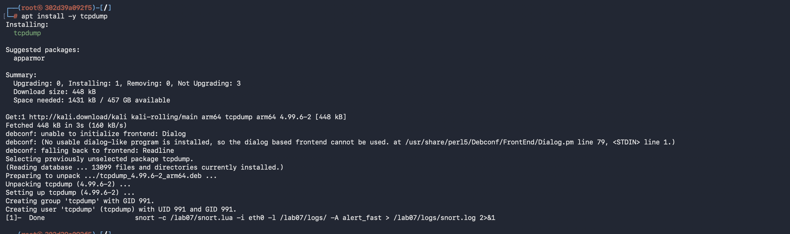

### 12. Nmap Alert Details
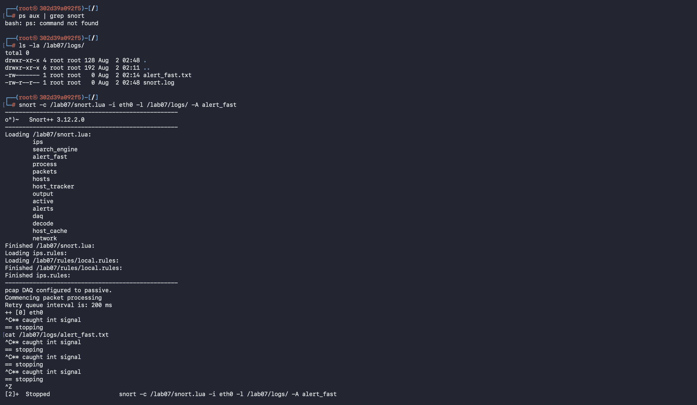

### 13. Nmap Ports Detected
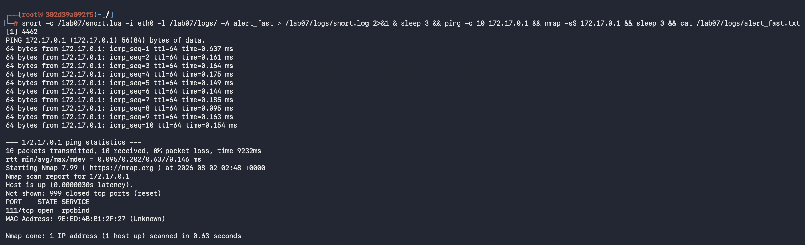

### 14. Alert Statistics
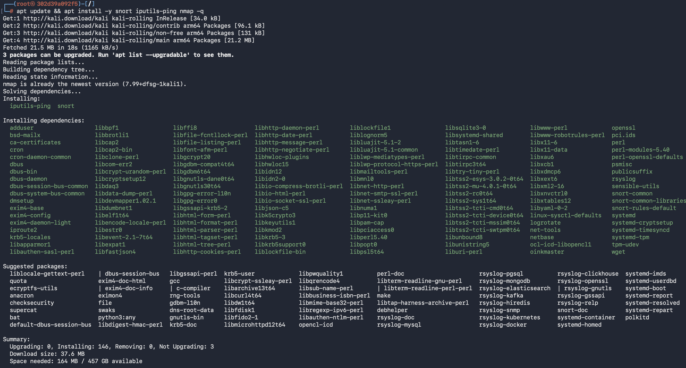

### 15. Alerts from 192.x.x.x Host
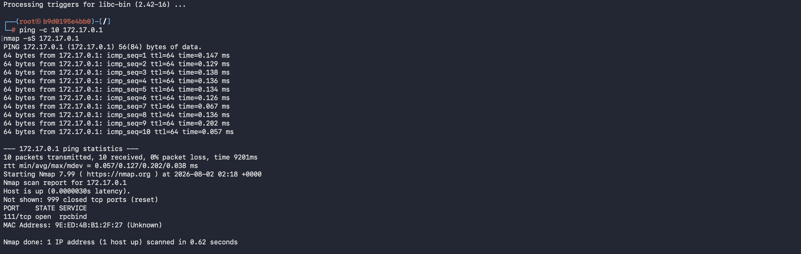

### 16. Snort Summary
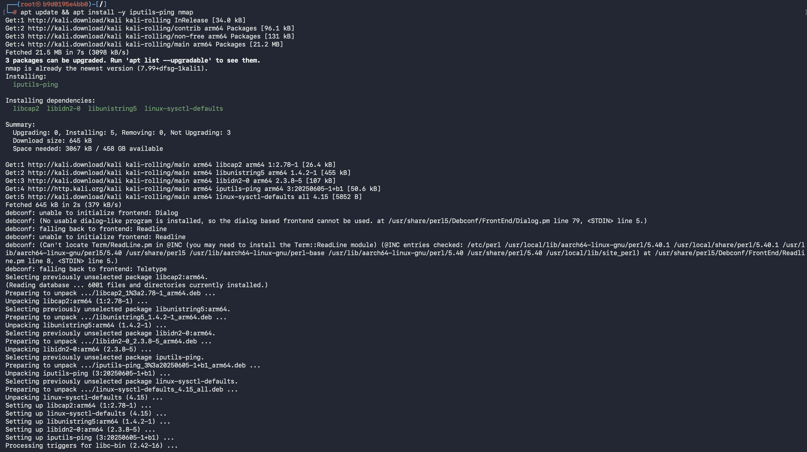
---

## Findings

- Successfully installed and configured Snort 3.
- Developed and deployed custom detection rules.
- Validated the Snort configuration without errors.
- Generated network traffic to test rule functionality.
- Successfully detected ICMP and scanning activity.
- Verified alert generation through Snort logs.

---

## Skills Demonstrated

- Network Intrusion Detection
- Snort Configuration
- Custom Rule Development
- Signature-Based Detection
- Linux Administration
- Network Traffic Analysis
- Security Event Investigation

---

## Conclusion

This lab demonstrated the deployment and configuration of Snort 3 as a Network Intrusion Detection System (NIDS). Custom detection rules were successfully created, validated, and tested using simulated network traffic. The resulting alerts confirmed that Snort correctly detected the configured events, providing practical hands-on experience in IDS deployment, rule development, and alert analysis—key competencies for a Security Operations Center (SOC) Analyst.
