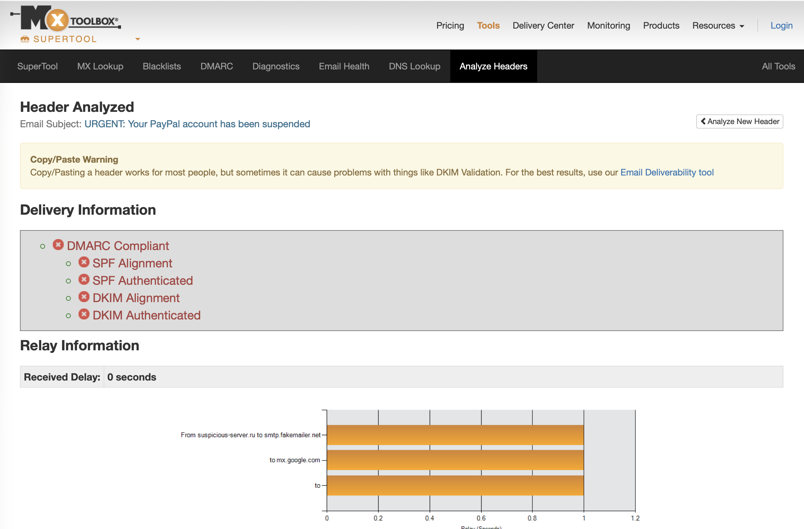
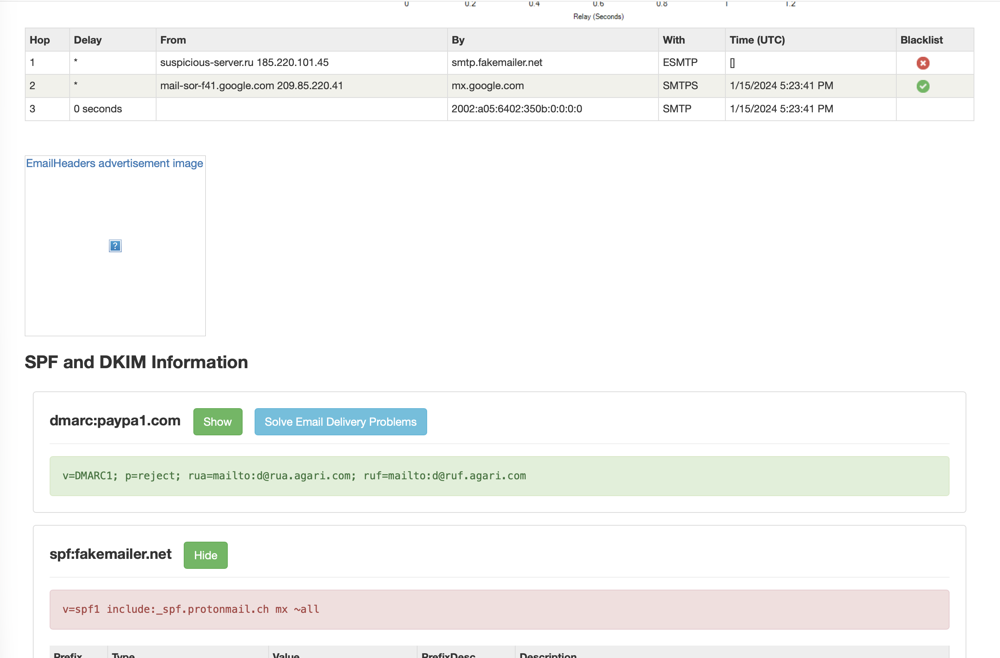
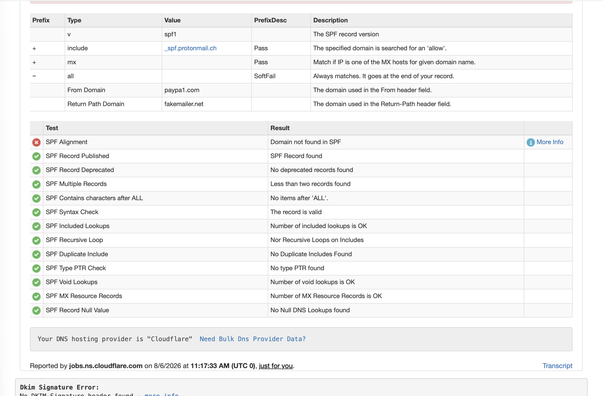
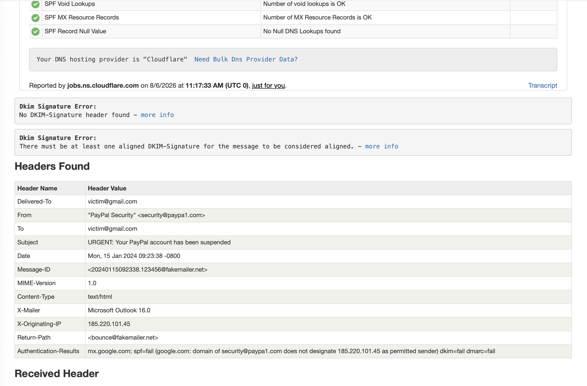
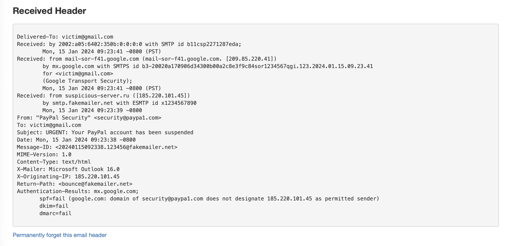
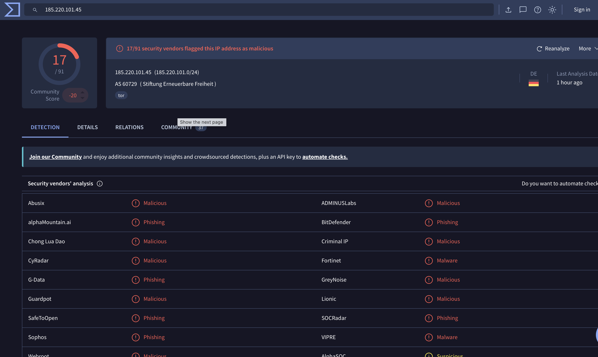

# SOC Lab Engineering Report
## Lab 08 — Phishing Email Analysis

---

| Field | Details |
|---|---|
| **Author** | Ibitayo Alasi |
| **Current Role** | IT Support Specialist |
| **Target Role** | SOC Analyst |
| **Lab Number** | 08 of 20 |
| **Phase** | Phase 2 — Detection |
| **Date Completed** | 7 August 2026 |
| **Status** | ✅ Complete |

---

## 1. Executive Summary

This lab demonstrates phishing email analysis using real-world investigation techniques. A PayPal impersonation phishing email was analyzed using MXToolbox for header analysis, VirusTotal for IP reputation checking, and manual IOC extraction. The investigation confirmed a sophisticated phishing attack using typosquatting, TOR anonymization, and triple authentication failure (SPF/DKIM/DMARC). 17 out of 91 security vendors flagged the originating IP as malicious.

---

## 2. Objectives

- Analyze a phishing email header using MXToolbox
- Identify authentication failures (SPF, DKIM, DMARC)
- Trace the email relay chain to identify suspicious servers
- Investigate the originating IP using VirusTotal
- Extract Indicators of Compromise (IOCs)
- Map findings to MITRE ATT&CK framework
- Write a professional phishing investigation report

---

## 3. Tools Used

| Tool | Purpose | URL |
|---|---|---|
| MXToolbox | Email header analysis | mxtoolbox.com/EmailHeaders.aspx |
| VirusTotal | IP/domain reputation | virustotal.com |
| Manual Analysis | Header inspection | N/A |

---

## 4. Phishing Email Sample

### Email Header Analyzed
```
From: "PayPal Security" <security@paypa1.com>
To: victim@gmail.com
Subject: URGENT: Your PayPal account has been suspended
Date: Mon, 15 Jan 2024 09:23:38 -0800
X-Originating-IP: 185.220.101.45
Return-Path: <bounce@fakemailer.net>
Authentication-Results: mx.google.com;
    spf=fail dkim=fail dmarc=fail
Received: from suspicious-server.ru ([185.220.101.45])
    by smtp.fakemailer.net with ESMTP
```

---

## 5. Analysis Findings

### 5.1 Authentication Failures — Triple Failure

| Check | Result | Meaning |
|---|---|---|
| SPF | ❌ FAIL | Sender IP not authorized by domain |
| DKIM | ❌ FAIL | No valid email signature found |
| DMARC | ❌ FAIL | Policy violation — p=reject |
| SPF Alignment | ❌ FAIL | Domain mismatch |
| DKIM Alignment | ❌ FAIL | No aligned signature |

**Triple SPF/DKIM/DMARC failure = confirmed email spoofing**

### 5.2 Email Relay Chain Analysis

| Hop | From | To | Status |
|---|---|---|---|
| 1 | suspicious-server.ru (185.220.101.45) | smtp.fakemailer.net | 🔴 BLACKLISTED |
| 2 | mail-sor-f41.google.com (209.85.220.41) | mx.google.com | ✅ Legitimate |
| 3 | mx.google.com | victim@gmail.com | ✅ Legitimate |

### 5.3 VirusTotal IP Analysis — 185.220.101.45

| Metric | Result |
|---|---|
| Malicious Detections | **17/91 vendors** |
| Community Score | **-20 (highly negative)** |
| IP Tag | **TOR exit node** |
| ASN | AS60729 (Stiftung Erneuerbare Freiheit) |
| Country | Germany (DE) |

**Vendors flagging as malicious/phishing:**
Abusix, ADMINUSLabs, alphaMountain.ai, BitDefender, Chong Lua Dao, Criminal IP, CyRadar, Fortinet, G-Data, GreyNoise, Guardpot, Lionic, SafeToOpen, SOCRadar, Sophos, VIPRE, Webroot

---

## 6. Indicators of Compromise (IOCs)

### Malicious IP Addresses
| IP | Verdict | Details |
|---|---|---|
| 185.220.101.45 | 🔴 Malicious | TOR exit node, 17/91 VT detections |

### Malicious Domains
| Domain | Verdict | Details |
|---|---|---|
| paypa1.com | 🔴 Malicious | Typosquatted PayPal domain |
| fakemailer.net | 🔴 Malicious | Attacker mail infrastructure |
| suspicious-server.ru | 🔴 Malicious | Russian originating server |

### Email IOCs
| Indicator | Value |
|---|---|
| Sender | security@paypa1.com |
| Return-Path | bounce@fakemailer.net |
| Subject | URGENT: Your PayPal account has been suspended |
| Originating IP | 185.220.101.45 |
| Message-ID | 20240115092338.123456@fakemailer.net |

---

## 7. Red Flags Identified

| # | Red Flag | Type | Severity |
|---|---|---|---|
| 1 | paypa1.com (1 not l) | Typosquatting | 🔴 Critical |
| 2 | SPF/DKIM/DMARC all failed | Authentication | 🔴 Critical |
| 3 | Originating IP = TOR exit node | Anonymization | 🔴 Critical |
| 4 | 17/91 VT vendors = malicious | Reputation | 🔴 Critical |
| 5 | Return-Path differs from sender | Spoofing | 🔴 High |
| 6 | "URGENT" subject line | Social Engineering | 🟡 Medium |
| 7 | suspicious-server.ru relay | Infrastructure | 🔴 High |
| 8 | Return-Path on fakemailer.net | Mismatch | 🔴 High |

---

## 8. Attack Methodology

```
Attacker
    │
    ├─► Registered typosquatted domain: paypa1.com
    │
    ├─► Set up mail server: fakemailer.net
    │
    ├─► Routed email through TOR exit node: 185.220.101.45
    │   (to hide real location)
    │
    ├─► Sent email with URGENT subject (social engineering)
    │
    ├─► Display name set to "PayPal Security"
    │   (legitimate looking but fake domain)
    │
    └─► Target receives email, thinks it's from PayPal
        and clicks malicious link
```

---

## 9. Evidence

### MXToolbox — Header Analysis (All Red)


### Email Relay Chain — Blacklisted Server


### SPF Analysis — Domain Mismatch


### Headers Found — Full Email Details


### Received Header — Full Trail


### VirusTotal — 17/91 Malicious Detections


---

## 10. SOC Analyst Relevance

| Skill Practiced | Real SOC Application |
|---|---|
| Email header analysis | Daily phishing investigation task |
| SPF/DKIM/DMARC analysis | Email authentication verification |
| IP reputation checking | Threat intelligence lookup |
| IOC extraction | Feeding blocklists and SIEM |
| TOR detection | Identifying attacker anonymization |
| Typosquatting identification | Brand protection monitoring |

---

## 11. MITRE ATT&CK Mapping

| Technique | ID | Observed |
|---|---|---|
| Phishing | T1566 | PayPal impersonation email |
| Spearphishing Link | T1566.002 | Malicious link in email body |
| Masquerading | T1036.005 | "PayPal Security" display name |
| Multi-hop Proxy (TOR) | T1090.003 | TOR exit node used |
| Acquire Infrastructure | T1583 | paypa1.com + fakemailer.net |

---

## 12. Recommended Actions

```
IMMEDIATE (within 1 hour):
1. Block IP 185.220.101.45 at email gateway and firewall
2. Block domain paypa1.com at email gateway
3. Block domain fakemailer.net at email gateway
4. Search email logs for other recipients of same campaign

SHORT TERM (within 24 hours):
5. Alert all users — do not click links from paypa1.com
6. Report domain to PayPal: spoof@paypal.com
7. Submit IOCs to MISP/OpenCTI threat intel platform
8. Check if any users clicked the phishing link

LONG TERM:
9. Enable DMARC reporting to catch future spoofing
10. Deploy email security gateway with sandboxing
11. Run phishing awareness training for all staff
```

---

## 13. Key Takeaways

1. **Triple failure = confirmed phishing** — SPF+DKIM+DMARC all failing is definitive
2. **Typosquatting is easy to miss** — paypa1.com vs paypal.com — train users carefully
3. **TOR = sophisticated attacker** — they're actively trying to hide their identity
4. **17/91 VT detections** — not all vendors detect it; threat intel is not 100%
5. **Relay chain tells the story** — always trace from bottom to top to find the real origin
6. **Return-Path mismatch** — legitimate companies always match Return-Path to From domain

---

## 14. Next Lab

**Lab 09 — Malware Sandbox Analysis**
Analyze a malware sample using Any.run online sandbox. Document network connections, registry changes, dropped files, and process tree. Map behaviors to MITRE ATT&CK.

---

*Report authored by Ibitayo Alasi — IT Support Specialist → SOC Analyst*
*GitHub: [github.com/ialasi](https://github.com/ialasi)*
